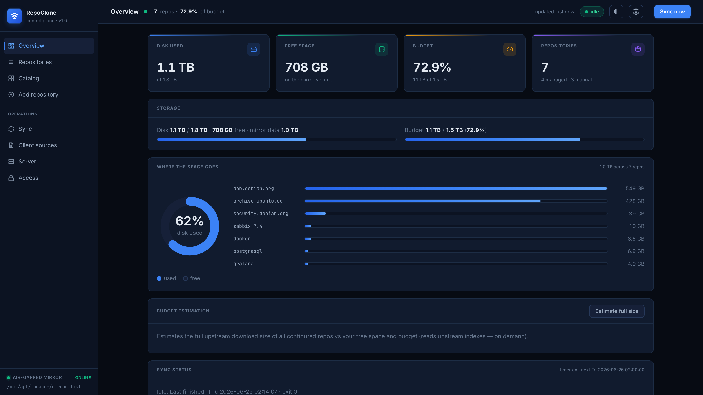
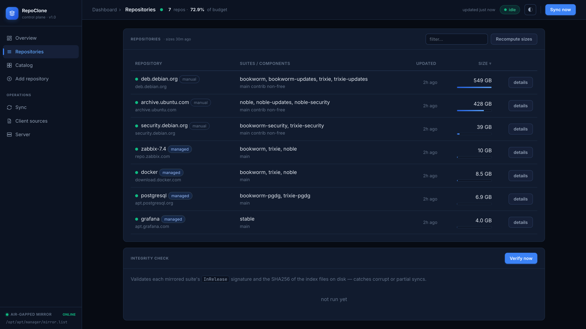
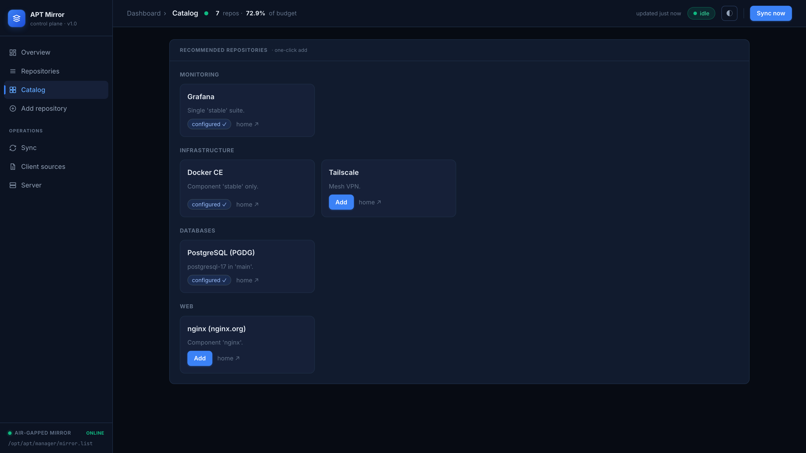
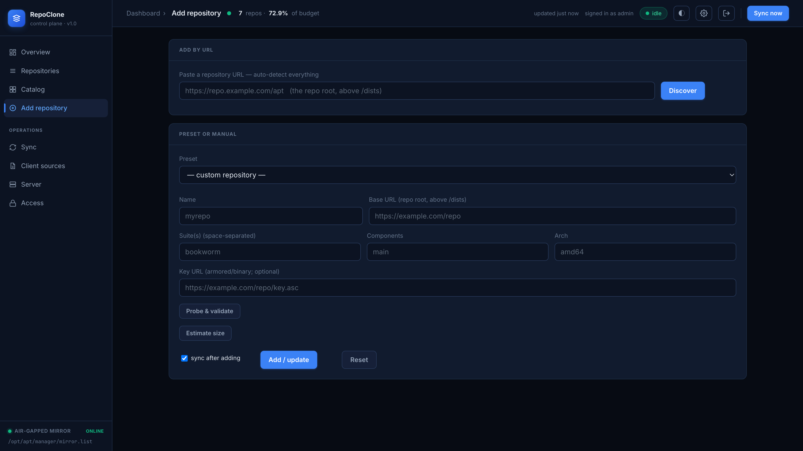
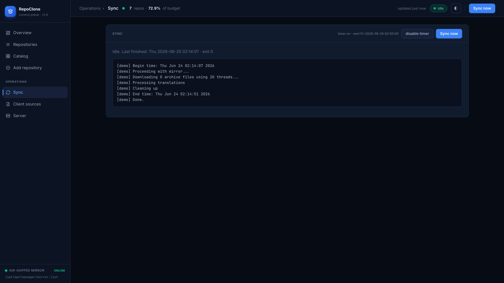
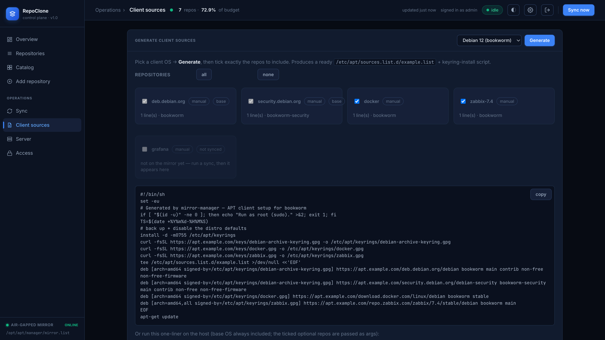
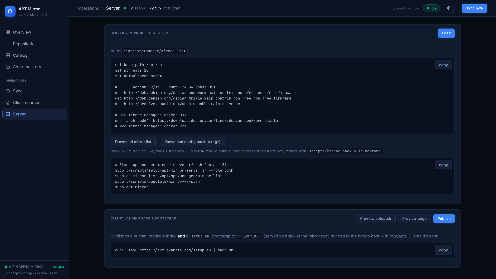
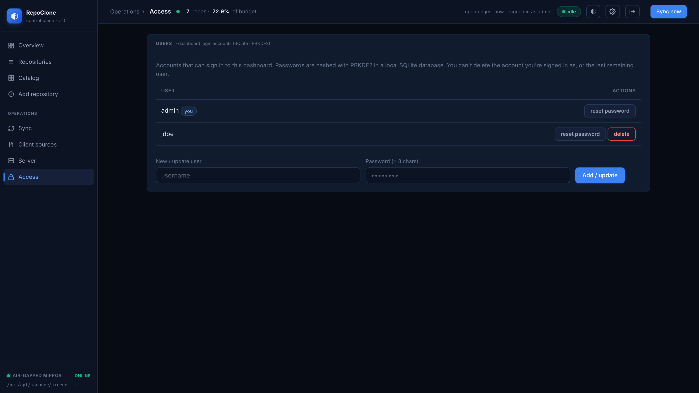

# RepoClone — air-gapped APT mirror kit

**Version 1.0.0** — first stable release.

Operational files for **`apt-mirror`** on **Debian 13**, **`/opt/apt`**, clients at **`https://apt.example.com`** (amd64, ~2 TB budget). The seed `config/mirror.list` mirrors only the **base OS** — **Debian 12/13** and **Ubuntu 24.04**; third-party repos (**Zabbix**, **HashiCorp**, **OpenProject**, **PostgreSQL**, **Docker**, **Grafana**, …) are added **on demand** from the mirror-manager dashboard (catalog / add-by-URL).

## Screenshots

The **mirror-manager** dashboard (add repos, sync, disk/budget, snapshots, client setup):

Sign-in (built-in login — local users in SQLite):


| Overview | Repositories |
|---|---|
|  |  |
| **Catalog** | **Add a repository** |
|  |  |

**Operations** — run a sync, generate client `sources.list`, manage the server, and control access:

| Sync | Client sources |
|---|---|
|  |  |
| **Server** | **Access (users)** |
|  |  |

> Generate these from the built-in **demo mode** (`…/?demo=1`) — public-safe mock data, no
> backend. See [`docs/screenshots/README.md`](docs/screenshots/README.md).

## Contents

| Path | Purpose |
|------|---------|
| `config/mirror.list` | Upstream `deb`/`clean` definitions — copy to `/etc/apt/mirror.list` on the **connected sync host** |
| `config/postmirror.sh` | Optional hook — copy to `/opt/apt/var/postmirror.sh`, `chmod +x` |
| `deploy/systemd/` | `apt-mirror.service` + `apt-mirror.timer` (daily sync) |
| `deploy/nginx/` | **nginx** vhost for `apt.example.com` → `root /opt/apt/mirror` |
| `deploy/logrotate.d/` | Rotate apt-mirror logs under `/opt/apt/var` |
| `scripts/` | **`setup-apt-mirror-server.sh`**, **`remove-apt-mirror-config.sh`** (teardown), `populate-mirror-keys.sh`, **`setup-apt-client.sh`**, **`run-mirror-clean.sh`**, `rsync-to-airgap.sh`, `check-mirror-health.sh`, **`setup-mirror-manager.sh`** |
| `scripts/mirror-manager/` | **Web dashboard** to add repos (presets/custom + probe), auto-configure, sync, and watch disk usage — see `docs/MIRROR_MANAGER.md` |
| `docs/` | Server/client setup, GPG, keys, Zabbix, airgap, **`TROUBLESHOOTING`**, **`SYSTEM_CLEANUP`** |

## First-time setup (one command)

On a fresh Debian 13 host, from this repo, stand up the whole stack — apt-mirror + timer +
nginx + keys **and** the web dashboard, then publish the client bootstrap:

```bash
sudo ./scripts/setup-apt-mirror-server.sh --role both --with-manager \
     --manager-listen 0.0.0.0 --manager-allow 10.0.0.0/26 --publish
```

Then:

1. **First sync** — `sudo systemctl start apt-mirror.service` (or the dashboard's *Sync now*); the daily timer is already enabled. Watch it: `journalctl -u apt-mirror.service -f`.
2. **Re-publish** once the sync finishes — dashboard **Server → Publish** — so `setup.sh` includes the now-synced repos (it skips un-synced ones).
3. **TLS** — point `ssl_certificate*` in `/etc/nginx/sites-available/apt.example.com.conf` at your cert, and DNS `apt.example.com` at this host.
4. **Manage repos** in the dashboard (add by URL / catalog / custom), and **set up clients** with one line:
   ```bash
   curl -fsSL https://apt.example.com/setup.sh | sudo sh                 # base OS + all synced repos
   curl -fsSL https://apt.example.com/setup.sh | sudo sh -s -- --list    # choose which to add
   ```

Minimal variant (no dashboard): `sudo ./scripts/setup-apt-mirror-server.sh --role both`.
Split hosts: **`--role sync`** (connected) and **`--role airgap`** (isolated nginx). See
**`docs/SERVER_SETUP.md`** and **`docs/MIRROR_MANAGER.md`**.

Manual steps (if you prefer not to use the script) are outlined below.

## Applying updates (existing host)

After `git pull`, apply new code the **safe** way — installs the dashboard app + `/opt/apt/var`
helper scripts and **restarts** the daemon (new Python only loads on restart), without touching
your live `mirror.list`, keys, nginx certs, or units:

```bash
cd ~/apt-mirror && git pull
sudo ./scripts/update-mirror-manager.sh
# then hard-refresh the browser; dashboard → Server → Publish if setup.sh/landing changed
```

Rare changes are applied by hand (the script prints the exact commands): **systemd unit** →
`cp` + `systemctl daemon-reload`; **nginx vhost** → review cert paths, `cp` + `nginx -t` +
`reload`; **manager unit/user/sudoers** → re-run `setup-mirror-manager.sh`.

> ⚠️ Do **not** re-run `setup-apt-mirror-server.sh` on a live host to "update" — it reinstalls
> the base-only seed `mirror.list` and would wipe repos you added. It's for first-time bring-up.

## Manage repos via the web dashboard (optional)

Instead of hand-editing `mirror.list`, install the **mirror-manager** on the sync host:

```bash
sudo ./scripts/setup-mirror-manager.sh
ssh -L 8080:127.0.0.1:8080 <sync-host>   # then open http://localhost:8080
```

Add a repo (preset or custom-with-probe) and it writes the `deb`/`clean` lines, fetches the
GPG key, and starts the sync — plus a live disk-usage gauge. See **`docs/MIRROR_MANAGER.md`**.

## Repos you must add manually (flat repos, e.g. Kubernetes)

The dashboard's **Add repository → Discover** and the **Catalog** handle standard repos with a
`dists/<suite>/<component>` layout (Debian/Ubuntu, Docker, HashiCorp, Grafana, Launchpad PPAs, …).
A few vendors publish **flat repos** — packages at the repo root, sourced with a trailing `/` and
no `dists/` tree — most notably **Kubernetes** (`pkgs.k8s.io`, also split **per minor version**).
`apt-mirror` can't mirror flat repos reliably, so the kit ships a dedicated fetcher,
**`scripts/mirror-flat-repo.sh`** (installed to `/opt/apt/var/`), which `postmirror.sh` runs on
every sync. **Don't put flat repos in `mirror.list`** — list them in `flat-repos.list` instead.

**Kubernetes** (substitute your minor version, e.g. `v1.31`):

1. List the repo in `/opt/apt/manager/flat-repos.list` (copy `config/flat-repos.list.example`),
   one `"<url> | <arches>"` per line:
   ```
   https://pkgs.k8s.io/core:/stable:/v1.31/deb/ | amd64 all
   ```
2. Publish the signing key (served to clients at `/keys/`):
   ```bash
   curl -fsSL https://pkgs.k8s.io/core:/stable:/v1.31/deb/Release.key \
     | sudo gpg --dearmor -o /opt/apt/keys/kubernetes.gpg
   sudo chmod 0644 /opt/apt/keys/kubernetes.gpg
   ```
3. Mirror it — automatic on the next sync (via `postmirror.sh`), or run it now:
   ```bash
   sudo /opt/apt/var/mirror-flat-repo.sh
   # one-off, verifying the upstream signature first:
   sudo KEYRING=/opt/apt/keys/kubernetes.gpg \
     /opt/apt/var/mirror-flat-repo.sh https://pkgs.k8s.io/core:/stable:/v1.31/deb/ "amd64 all"
   ```
   It downloads + SHA256-verifies the `amd64`/`all` `.deb`s into `/opt/apt/mirror/pkgs.k8s.io/…`
   (idempotent — re-runs fetch only what changed).
4. Configure clients (install the key first:
   `sudo curl -fsSL https://apt.example.com/keys/kubernetes.gpg -o /etc/apt/keyrings/kubernetes.gpg`):
   ```
   deb [signed-by=/etc/apt/keyrings/kubernetes.gpg] https://apt.example.com/pkgs.k8s.io/core:/stable:/v1.31/deb/ /
   ```

> The dashboard repo list and **Client sources** generator are `dists/`-only, so they won't show
> or generate config for flat repos — use the client line above by hand.

## Connected sync host (manual)

1. Install: `sudo apt update && sudo apt install -y apt-mirror`
2. `sudo install -d -m0755 /opt/apt`
3. `sudo cp config/mirror.list /etc/apt/mirror.list` — edit **Zabbix major** and **Debian 13** suite names if needed
4. `sudo cp config/postmirror.sh /opt/apt/var/postmirror.sh && sudo chmod +x /opt/apt/var/postmirror.sh`  
   `sudo cp scripts/run-mirror-clean.sh /opt/apt/var/run-mirror-clean.sh && sudo chmod +x /opt/apt/var/run-mirror-clean.sh`
5. Run once: `sudo apt-mirror` (long-running; verify disk with `du -sh /opt/apt`)
6. `sudo cp deploy/systemd/apt-mirror.service deploy/systemd/apt-mirror.timer /etc/systemd/system/`
7. `sudo systemctl daemon-reload && sudo systemctl enable --now apt-mirror.timer`
8. **Publish GPG keyrings for clients:** `sudo apt install -y debian-archive-keyring dpkg` then `sudo ./scripts/populate-mirror-keys.sh` — creates **`/opt/apt/keys/`** (served as **`/keys/`** after nginx deploy; see `docs/MIRROR_HOST_KEYS.md`)

Logs: `sudo journalctl -u apt-mirror.service -b` and files under `/opt/apt/var/` if present.

## Airgap mirror server (nginx, manual)

1. Install nginx on the airgap host: `sudo apt install -y nginx`
2. Sync `/opt/apt` from the sync host (`scripts/rsync-to-airgap.sh` or removable media) — see `docs/AIRGAP_TRANSFER.md`
3. `sudo cp deploy/nginx/apt.example.com.conf /etc/nginx/sites-available/` and `sudo ln -sf /etc/nginx/sites-available/apt.example.com.conf /etc/nginx/sites-enabled/`; adjust `ssl_certificate` paths in that file if needed
4. `sudo nginx -t && sudo systemctl reload nginx`
5. Point **DNS** `apt.example.com` at this host
6. On each client: run **`scripts/setup-apt-client.sh`** (see `docs/CLIENT_SETUP.md`), generate sources from the dashboard **Client sources** view, or copy the per-vendor blocks from `docs/CLIENT_MIRROR_URLS.md`

## Storage

Keep mirrored data **≤ ~1.6–1.7 TB** on a **2 TB** disk; monitor with `df` and `du -sh /opt/apt`.

### Minimum storage recommendation

Ballpark **amd64-only** download sizes (vary with components/arch; use the dashboard's
**Budget estimation** for exact current numbers — it sums the upstream `Packages` `Size:` fields):

| Component | Approx size |
|---|---|
| Debian 12 *bookworm* (main+contrib+non-free+non-free-firmware, +updates/+security) | ~150–250 GB |
| Debian 13 *trixie* (same components) | ~150–250 GB |
| Ubuntu 24.04 *noble* (main + **universe**, +updates/+security) | ~300–450 GB |
| **Base OS subtotal** (the seed `mirror.list`) | **~0.6–0.9 TB** |
| Third-party (each): PostgreSQL/PGDG ~7 GB·suite, Zabbix ~10 GB, HashiCorp/Docker/Grafana/etc. a few GB | tens of GB total |
| Snapshots (hardlink) | ~0 until packages churn; budget ~10–20% headroom |
| Sync working space + free-space floor (`MIN_FREE_GB`, default 50) | ≥ 50 GB free |

**Sizing rule of thumb:**

- **Minimum:** ~**1.5 TB** for the base OS + a handful of third-party repos with a little headroom.
- **Recommended:** **2 TB** (the budget this kit targets) — comfortable for base OS + most catalog repos + snapshots + the free-space floor.
- **Trim levers** if space is tight: drop a Debian release, drop Ubuntu `universe`, or drop `contrib`/`non-free`. Dropping third-party repos saves little (they're small).

The disk-full **guard** aborts a sync below `MIN_FREE_GB`, and the dashboard shows live used/free/budget plus a per-repo size breakdown — so you can right-size before committing bandwidth.

## References

- `docs/SERVER_SETUP.md` — **`setup-apt-mirror-server.sh`**  
- `docs/GPG_KEYS.md` — trust and keyrings  
- `docs/MIRROR_HOST_KEYS.md` — **`/opt/apt/keys`** + nginx **`/keys/`**  
- `docs/CLIENT_MIRROR_URLS.md` — client **`URIs=`**, key URLs, deb822 examples  
- `docs/CLIENT_SETUP.md` — **`setup-apt-client.sh`** on clients  
- `docs/CLIENT_SOURCES.md` — dashboard **Client sources** generator (deb822 + install script)  
- `docs/AIRGAP_TRANSFER.md` — cross the air gap (**`rsync-to-airgap.sh`** / removable media)  
- `docs/ZABBIX_REPOS.md` — Zabbix URL mapping  
- `docs/OPENPROJECT_REPO.md` — **OpenProject** URL mapping (Debian 12 only; numeric suite)  
- `docs/POSTGRESQL_REPO.md` — **PostgreSQL/PGDG** URL mapping (`<codename>-pgdg main`; postgresql-17 lives in `main`)  
- `docs/RELEASE_GOVERNANCE.md` — EOL and upgrades  
- `docs/TROUBLESHOOTING.md` — **“already running”**, stale lock, **quiet log after cnf**  
- `docs/SYSTEM_CLEANUP.md` — **`apt autoremove`**, old kernels, cache cleanup  
- `docs/MIRROR_MANAGER.md` — **web dashboard**: add repos + auto-configure + sync + disk usage  
- `docs/RESET.md` — remove configs / **`/opt/apt`**, redeploy from scratch  
- `docs/SECURITY.md` — **security model**, hardening, and recommended follow-ups  
